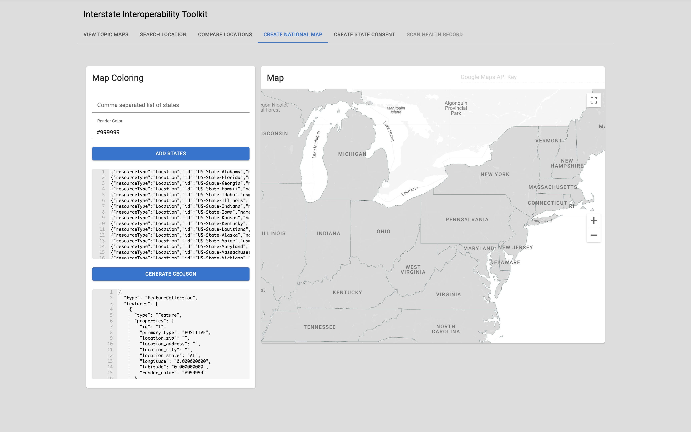

## Workflow - Create US States Map

Preview: [https://workflow-create-us-states-map-awatson-3765ac6b37f10f5ae8b3df0e7.pages.mitre.org](https://workflow-create-us-states-map-awatson-3765ac6b37f10f5ae8b3df0e7.pages.mitre.org)  



### Installation

```sh
# copy the source code
$ git clone https://gitlab.mitre.org/awatson/workflow-create-us-states-map

# install dependencies
$ cd webpack-react-llm
$ npm install

# build the app
$ npm run build

# open the app
$ open dist/index.html
```


### Getting a Google API Key 

- [Google Maps Platform](https://developers.google.com/maps)  
- [Use API Keys](https://developers.google.com/maps/documentation/javascript/get-api-key)  